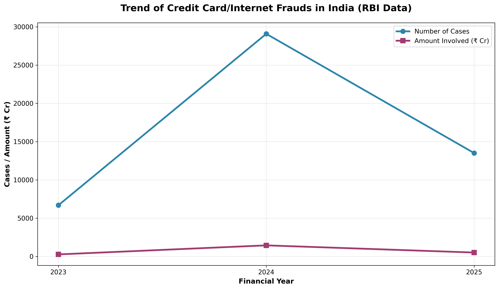
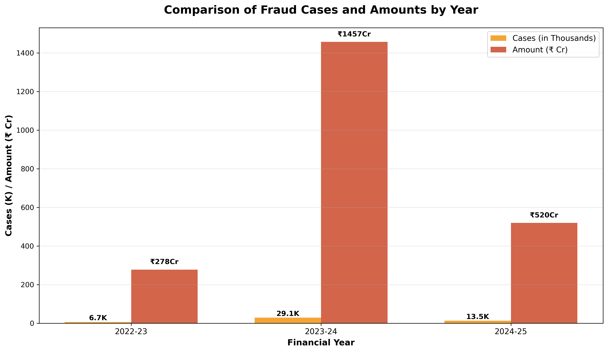
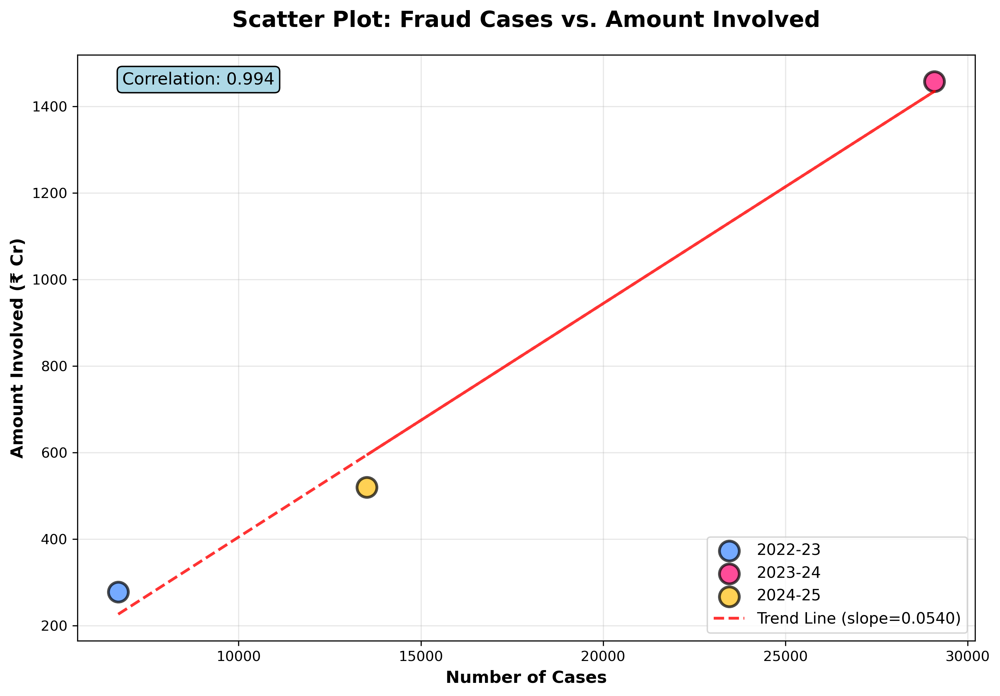

# Credit Card Fraud Detection: RBI Data Analysis

   

## 🎯 Project Overview

This project analyzes credit card and internet banking fraud data from the **Open Government Data Platform India** (data.gov.in), based on RBI reports. It performs comprehensive **Exploratory Data Analysis (EDA)** to uncover trends in fraud cases and financial amounts, providing insights that can inform fraud detection strategies and policy decisions.

**🔗 Data Source**: [Year-wise RBI Data on Frauds](https://data.gov.in/resource/year-wise-reserve-bank-india-rbi-data-frauds-reported-scheduled-commercial-banks-category)

## 📊 Dataset Overview

Our analysis covers aggregate fraud data for financial years **2022-23 to 2024-25**, providing insights into:
- Number of fraud cases reported to RBI
- Total monetary amount involved in frauds (₹ Crores)
- Year-over-year trends and patterns

| Financial Year | Number of Cases | Amount Involved (₹ Crore) |
|----------------|-----------------|---------------------------|
| 2022-23       | 6,699          | 278                       |
| 2023-24       | 29,082         | 1,457                     |
| 2024-25       | 13,516         | 520                       |

📁 [**View Full Dataset**](data/rbi_fraud_data.csv)

## 🔍 Key Data Insights

- **📈 Dramatic Trend Variations**: Fraud cases spiked by **334%** from FY23 to FY24, then declined **53.5%** in FY25
- **💰 High Financial Impact**: Peak loss of **₹1,457 Crores** in FY24, representing a **5x increase** from FY23
- **🔗 Strong Statistical Correlation**: Correlation coefficient of **0.994** between number of cases and amounts involved
- **⚠️ Policy Implications**: Sharp variations indicate the need for **adaptive ML models** and **real-time detection systems**
- **📊 Average Impact**: Each fraud case results in an average loss of **₹4.57 lakhs**

## 📈 Interactive Visualizations

### 1. Trend Analysis: Multi-Year Overview


**Key Insights**: 
- Sharp rise in FY24 correlates with increased digital adoption during post-COVID recovery
- FY25 decline suggests improved fraud prevention measures and security awareness
- Both metrics follow synchronized trends, indicating systematic relationship between case volume and financial impact

### 2. Year-over-Year Comparison


**Key Insights**: 
- FY24 shows dramatic increases: **4x cases** and **5x amounts** compared to FY23 baseline
- Higher average amounts per case in FY24 indicate more sophisticated, high-value fraud attempts
- FY25 recovery is still **2x elevated** compared to pre-spike FY23 levels

### 3. Correlation Analysis: Cases vs. Financial Impact


**Key Insights**: 
- Nearly perfect linear relationship (correlation = **0.994**) between cases and amounts
- Trend line slope (**0.054**) indicates each 1,000 additional cases correlates with ~**₹54 Cr** additional loss
- FY24 appears as clear outlier, suggesting external factors driving unprecedented fraud levels

## 💻 Technical Implementation

### 🔧 Full Analysis Notebook
📓 **[Complete Jupyter Notebook](project_demo.ipynb)** with detailed code, outputs, and interactive visualizations

### 🛠️ Technologies Used
- **Python 3.10+** for data processing and analysis
- **Pandas** for data manipulation and statistical analysis
- **Matplotlib** for creating publication-quality visualizations
- **NumPy** for numerical computations and correlation analysis
- **Jupyter Notebook** for interactive development and documentation

### 🚀 Run Locally
```bash
# Clone the repository
git clone https://github.com/kudupudimohankumar/credit_card_fraud_visulization.git
cd credit_card_fraud_visulization

# Install dependencies
pip install -r requirements.txt

# Launch Jupyter notebook
jupyter notebook project_demo.ipynb
```

## 📄 Data Sources & Methodology

- **Primary Data**: Open Government Data Platform India (data.gov.in)
- **Data Processing**: Aggregation of RBI reported fraud cases
- **Analysis Period**: Financial Years 2022-23 to 2024-25
- **Methodology**: Exploratory Data Analysis with statistical correlation analysis

## 📝 License & Usage

This project uses **open government data** and is available for educational and research purposes. For production fraud detection systems, additional privacy-compliant data sources and enhanced security models would be required.

<!-- ## 🤝 Contributing

Contributions are welcome! Please feel free to submit issues, feature requests, or pull requests to enhance this analysis. -->

---

<div align="center">

**Built using Open Government Data**  
*Last updated: October 2024*

[🔍 Explore the Code](project_demo.ipynb) | [📊 View Dataset](rbi_fraud_data.csv) | [📈 See Visualizations](images/)

</div>
